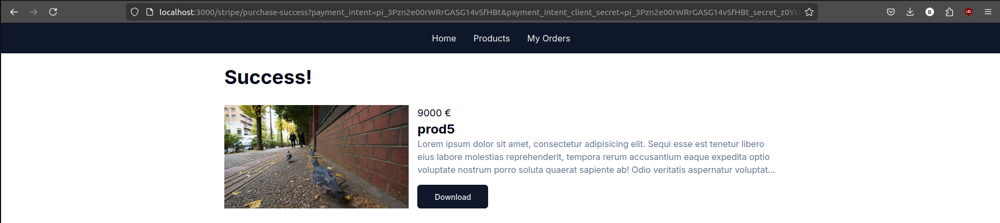

This is a [Next.js](https://nextjs.org/) project to apply the skills I am learning on this
Full-stack technology. It is my first e-commerce store and it relies on Next.js, Prisma, Strip
and Tailwind.

This project was meant to be only for knowledge development and can't be considered Production
ready.

I leave you with some screenshots of the developed pages and emails:

# Home page

# Products page

# Purchase Page

## Purchase Success Page

## Purchase Email

# My Orders

# Admin area
## Dashboard

## Simple Browser Authentication for Admin area

## Products Administration

## New / Edit product 

## Customers Administration

## Sales Administration
